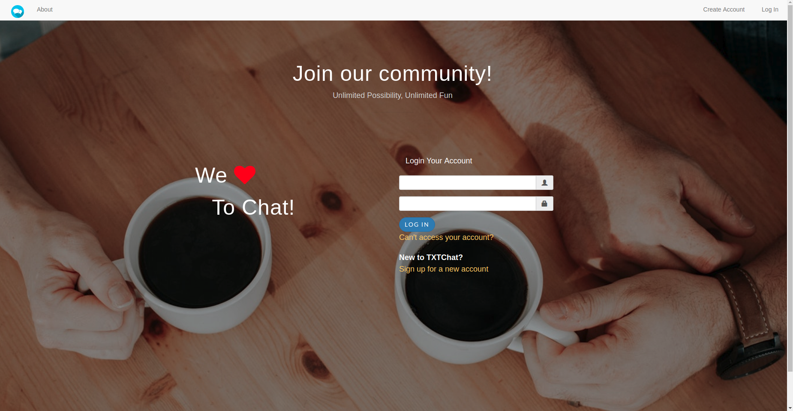
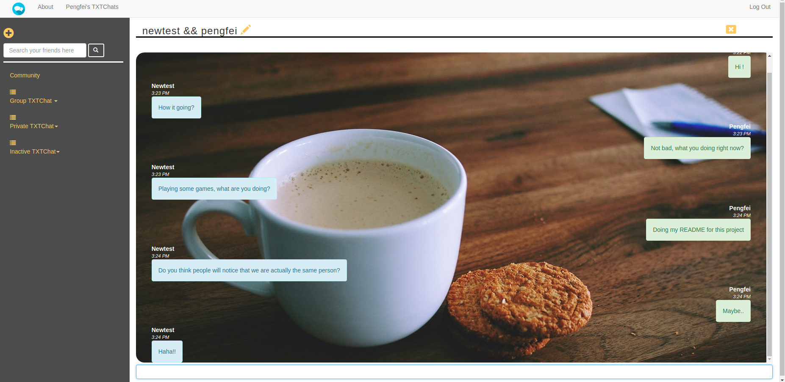

Project TXTChat

**TXTChat** is a chatting app that uses web sockets to transmit real time communication between users.

-------------------------------------------------

-------------------------------------------------

-------------------------------------------------

Technologies
-------------------------------------------------
* JQuery
* Ruby on Rails
* Web Socket(Action Cable)
* CSS / Bootstrap
* Postgresql
* ERB templating
* Bcrypt (Authentication)

Summary
-------------------------------------------------
A week long project based on Ruby on Rails framework and Action Cable web socket to provided users real time messaging communication.
